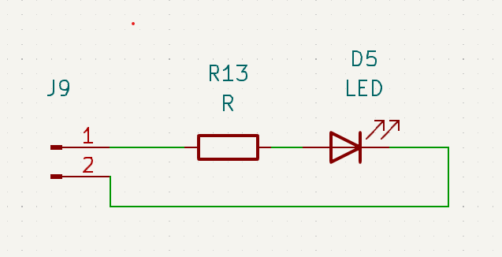

# LED

The 'Light-Emitting-Diode'. Since I first saw the faint glow of the LED I have been in awe. They're so beautiful!

But how we use them in a design?

First thing to remember is that the LED is 'Current-controlled'. This means that the voltage running thorough it is not that important but the current is!

A good rule-of-thumb is that we can send 20mA through a regular 5mm LED. you might find other numbers if you are using very small LEDs.

Ohms law will help us find the right current limiting resistor for our LED:

* if we have 12V, that makes 12V = R x 0.02A => 12/0.02 = 600Ohms

* if we have 5V that makes 5V = R x 0.02A => 5/0.02 = 250Ohms

* and so on..

This will only work as long as you have a voltage that is higher than the voltage drop required to get the LED to light up. 

You can even put LEDs in series if you have the need but be aware that a limiting resistor will have to handle all the power.

##### Things to observe

* The resistor is located before the LED but the order is not important. you can have it after the diode if you want.

* The LEd is current-controlled so you can have a high voltage across it as long as you limit the current.

* The + is called the Anode and the - is called the Cathode. If you put it in the wrong way it will not work.

* it will still work as a regular diode. 

* Red LEDs have the lowest voltage drop, about 1.2V
