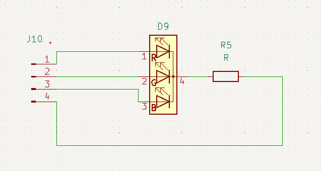

# Multi-color LED

Just like the regular LED, but more!

This component merges multiple LEDs into a single package. As you can see on the symbol below they are 3 different diodes but with a shared cathode pin.

This allows you to use one or more colors at the same time.

Ususally these will have an opaque housing so to mix the colors a bit more. Blending colors allow you to make all the colors of the rainbow and more!

##### Things to observe

* The 3 diodes share a single common resistor. it should be able to handle power for all diodes at the same time.

* The schematic above shows a common cathode design but these also exist with common Anode. Usage depends on how you want to control them.

* 
