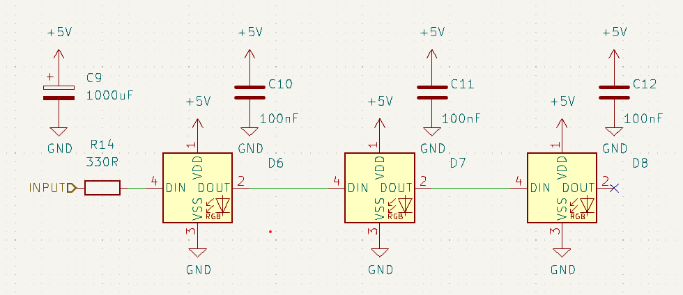

# Addressable LED

Want to get really fancy? try adding a few addressable LEDs to you next project for that extra bling!

They have many names. the original is WS2812 but you might know them as 'Neopixels'.

New variants have since showed up like the SK6812 which adds a separate white diode so we now have 4 diodes, RGBW.

the SK6812 comes in 3 variants: warm, cold and natural white. All of them refer to the white diode on the chip. You still have all the functionality of the RGB diodes so you can color correct using the colored one.

The WS2812 is pretty straightforward to use. Have a resistor on the input to the first one and add a 100nF capacitor close to each LED. Ideally also have a 1000uF capacitor at the beginning of a strip - this is not really applicable on a PCB though.

##### Things to observe

* Add a current limiting resistor in series with the first LED.

* If you only have a single LED then remember to add a 'no connect' to the output to remove DRC errors

* Additional LEDs (and capacitors) can be added as needed.

* these LEDs can draw A LOT of power. Make sure you have the power supply for your project!
