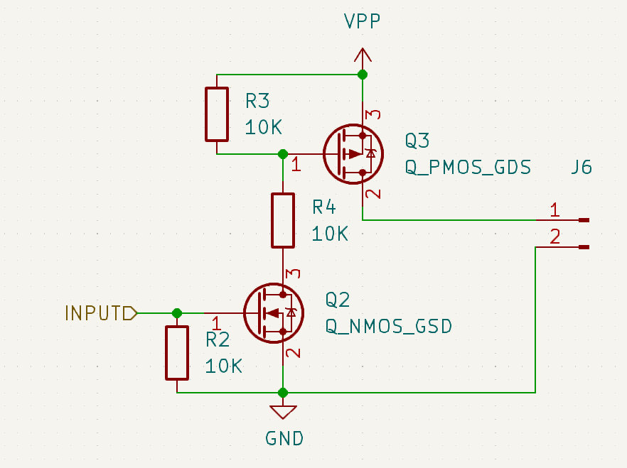

# MOSFET

Metal-Oxide-Semiconductor Field-Effect-Transistor. Or just 'FET'. or maybe even 'transistor' (while technically true it's a variant of a transistor).

This little thing can be used to toggle large voltages and currents using a small signal from a microcontroller very easily.

### 2 variants

there are 2 variants - the NMOS and the PMOS. They work opposite each other where the NMOS is for the Negative side of a load, the PMOS is for the Positive side of the load.

The Nmos is easier to operate since logically it's more intuitive. the PMOS requires a negative voltage (relative to the source voltage) to work, therefore a common construction is to use an NMOS stage to drive the PMOS.

### NMOS

###### Observe the following

* Vpp is the power supply to the load which is connected at J5.

* The pinout of the FET is important! 'Source' pin is connected to ground

* R7 is a pull-down resistor that makes sure that the gate is closed if the signal is not applied (for example during programming and reset)

* There is a 'body-diode' which is a side-effect of how a MOSFET works (see the small symbol inside the transistor). this diode allows a reverse current to flow from GND towards the supply if there is any.

### PMOS

###### Observe the following

* The PMOS uses an NMOS as a driving stage (Q2 and R2)

* R4 is not always necessary - here it will allow for extra large voltages on Vpp (look for max Vds in the datasheet for the NMOS)

* R3 is a pull-up for closing the PMOS

* Q3 uses a different pinout than Q2 - **ALWAYS check your datasheet for the correct pinout!**
