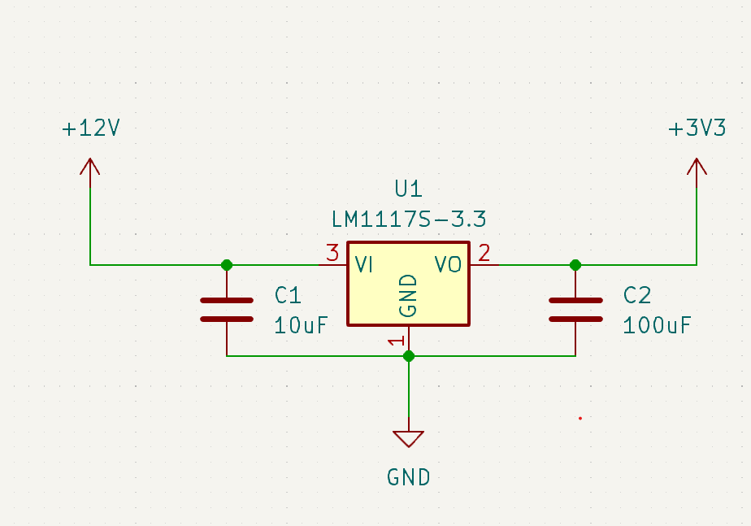

# Low-Dropout regulator

or just LDO for short. This device will take an input voltage and lower it to micro-controller friendly levels.

How does it do that? By heating up. Well, not entirely but a LOT of the excess energy is wasted as heat. that means two things.

* higher input voltage means a component running hot

* it's not as efficient as a switching regulator

It does mean however, that it is super simple to use! Juts look at the schematic.

#### what does low-dropout actually mean?

due to the nature of the regulator, the input voltage needs to be higher than the output. The 'drop' is the needed difference in order for the regulator to work properly. when talking about 'low dropout' it means that as long as the input voltage is just slightly higher than the output, it will work.

In practice, we're talking values that might be 2-400mV higher. THe LM1117 shown here is an oooold part and requires at least 1.1V higher input so check.that.datasheet!

Another thing you want to check is the 'Quiescent current' which is the current consumption just to keep the component runing. the lm1117 have a quiescent current of 5mA which is quite high. again, it's an old component. you can most likely find better LDO regulators with much better specs but the working principle is the same.

##### Things to observe

* This is a particular part (LM1117) - Be aware af different pinouts for other parts!

* The last number of the part '3.3' means that this component will provide 3.3V on the output

* the LM1117 comes in many output voltages. it even have an adjustable one so **BE CAREFUL** when ordering!

* The input and output capacitors are needed to stabilize the regulator. always check the datasheet for your regulator to see what values are needed. They might be the same on either side - they might not.
