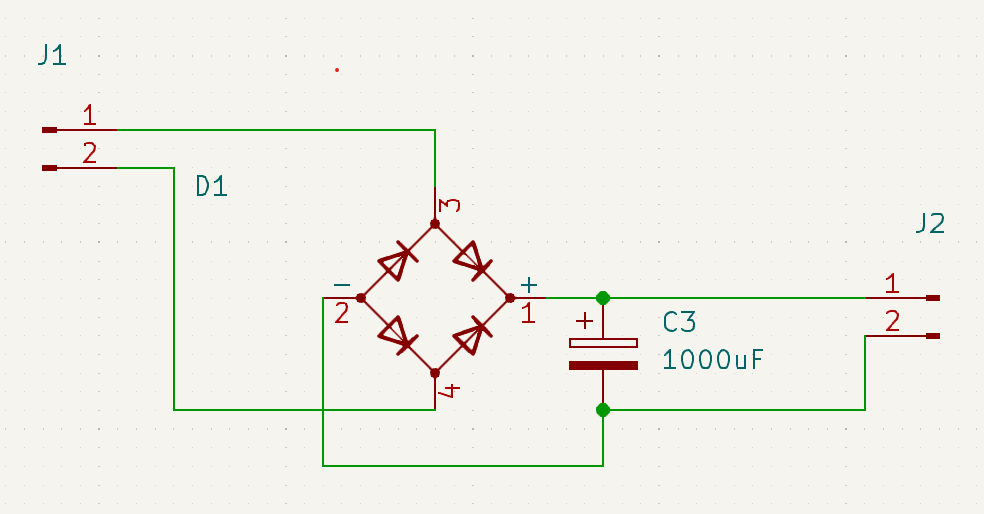

# Rectifier

Ah. The old rectifier. It's been around since forever but it still does a great job.

So, you have an AC voltage which swings both positive and negative. This rectifier is called a 'Full bridge' rectifier, since it will turn the negative side of the AC signal into a positive side.

This process however, creates a noticeable voltage dip so to smooth out the drop you want to add a quite large capacitor to the output. A 1000uF polarized capacitor usually does the trick but if you can make it larger it's even better.

##### Things to observe

* J1 is the AC side (usually after a transformer to lower the voltage)

* J2 is the DC side. You might still want another regulator like an LDO or a switching regulator after this module.

* This module can be constructed from either a single part or 4 discrete diodes.

* If you have large sudden current draws (like in an amplifier), you might want a larger capacitor  
