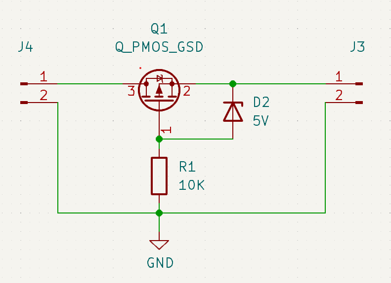

# Reverse polarity protection

Every once in a while you're making a project where the power input is not well defined. in these cases it's practical to be able to protect the input from plugging in the power in reverse. there's a very real risk of starting a fire if something is not able to withstand the reverse voltage. Ask me how I know...

the module is placed in the power path before regulators.

This is the schematic - J4 is the input and J3 is output

##### Things to observe

* the PMOS transistor have a body-diode (see the small diode symbol inside). On power-up the body diode will conduct and let a small voltage through.

* When the voltage exceeds the breakdown voltage of Zener diode D2 (5V in this case), the diode will open and thus open the gate of the transistor further.

* R1 will limit the current through D2

* If reverse polarized, the body diode have no voltage to let through and D2 will not open the gate.
