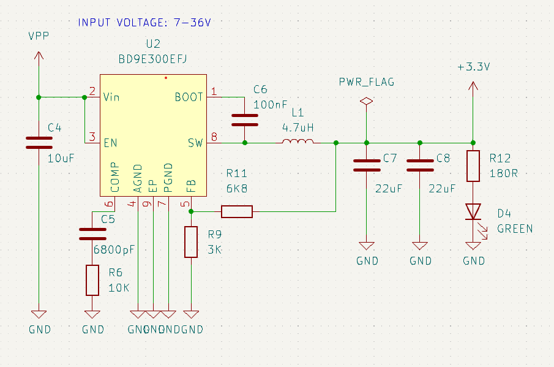

# Switching regulator

This I think is the most advanced module in the collection (for now). The this regulator will allow you to drop from 7 to 36V into a manageable 3.3V on the output. And with a high efficienct too!

This module is also very specific since it will label a non-standard part. this means that you have to design the BD9E300EJF component yourself! but it's worth it in the end, you will have gained knowledge on how to make your own parts (if this is the first time) and if you have done parts before, you can do this one quite quickly.

I can write a lot about how switching regulators work but I will let you google that yourself. Suffice it to say there are a few different types, noticeably:

* Buck converters - these will lower the voltage based on the input

* Boost converters - these will raise the voltage based in the input

* Buck/Boost - these can work with both higher and lower input voltages (but are more advanced to implement)

The schematic below is my tested design that I currently use for high input voltages. the controller is quite expensive so if I can get by using an LDO I will do that. but this design IS nice and can come in handy if you need a wide input range

##### Things to observe

* The feedback (pin 5) and the resistors R9 and R11 define the output voltage. These values will result in a 3.3V output.

* The regulator needs quite a lot of capacity on the output in order to stabilize it. C7 and C8 takes care of this.

* R12 and D4 can be omitted if you don't need a LED to indicate the power status.

Another nice thing about these kind of regulators is that with newer parts the switching frequency goes up. higher frequencies mean smaller parts which leads to a more compact design. Neat!
